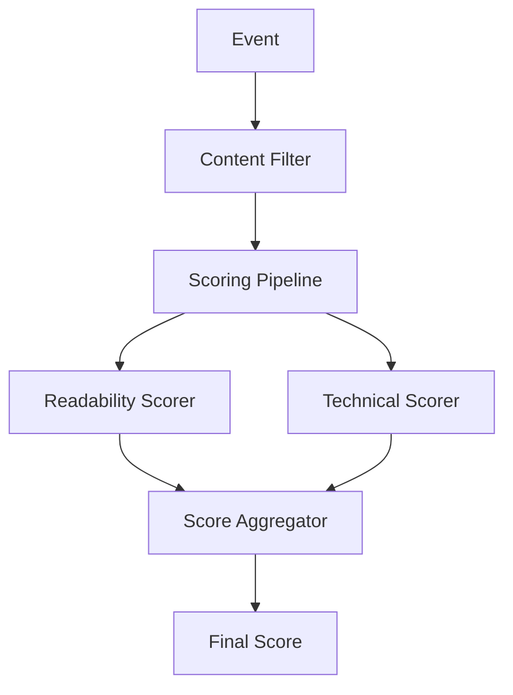

# Text Conversation Rewards: New Architecture

This document outlines the implementation of the platform-agnostic, event-driven architecture for the text-conversation-rewards system.

## Current Implementation Status

We've implemented and cleaned up these key components:

- ✅ **Core Framework**
  - CloudEvents standardization for cross-platform events
  - Module base interface for consistent processing
  - Module chain system for configurable processing pipelines
  - Event router for directing events to appropriate chains

- ✅ **Scoring System**
  - Base scorer interface for extensible scoring strategies
  - Readability scorer using text-readability package
  - Technical scorer for code quality and documentation
  - Score aggregator for combining multiple scoring strategies

- ✅ **Platform Adapters**
  - Platform adapter base interface
  - GitHub adapter implementation

- ✅ **Core Modules**
  - Content filter for validation and filtering
  - Scoring pipeline for orchestrating multiple scorers
  - Comment processors for PR and issue comments
  - Comment grouping for consecutive comment handling

## Project Structure

```
src/
├── adapters/          # Platform-specific adapters
├── components/        # Reusable UI components
├── config/           # Configuration handling
├── core/             # Core system components
├── experimental/     # Experimental features
│   ├── modules/      # Experimental modules
│   └── README.md     # Documentation for experimental features
├── github/           # GitHub-specific functionality
├── modules/          # Active processing modules
├── processors/       # Content processors
├── scorers/          # Scoring implementations
├── services/         # Service implementations
└── utils/            # Utility functions
```

## Module System

The application uses a modular chain-based architecture where functionality is composed through chainable modules:



## Adding New Features

### New Scorer
1. Create a new class extending `BaseScorer` in `scorers/`
2. Implement the required scoring logic
3. Add unit tests in `__tests__/scorers/`
4. Export the scorer in `scorers/index.ts`

### New Module
1. Use the template in `docs/module-template.md`
2. Create your module extending `BaseModule` in `modules/`
3. Add unit tests in `__tests__/modules/`
4. Export the module in `modules/index.ts`

For experimental features:
1. Create your module in `experimental/modules/`
2. Document it in `experimental/README.md`
3. Once proven, migrate to main modules directory

## Running Examples

To run the system:

```bash
# Install dependencies
bun install

# Start the server
bun run src/server.ts
```

## Testing

- Tests mirror the source structure
- Each major component has its own test suite
- Mock implementations provided where needed
- Use `bun test` to run tests

## Key Design Principles

1. **Modularity**: Each component does one thing well
2. **Extensibility**: Easy to add new scorers and modules
3. **Platform Agnosticism**: Works with any text content source
4. **Clear Architecture**: Organized, documented, and maintainable
5. **Progressive Enhancement**: Start simple, add complexity as needed

## Future Improvements

1. Add more scoring strategies:
   - AI-based relevance scoring
   - Code quality scoring
   - Language quality scoring

2. Expand platform support:
   - Google Docs adapter
   - Slack adapter
   - Discord adapter

3. Enhance configuration:
   - YAML-based module configuration
   - Dynamic module loading
   - Custom scoring weights

4. Improve testing:
   - Integration tests
   - Performance benchmarks
   - Coverage reports
