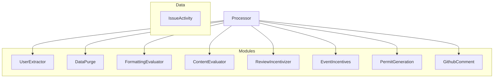
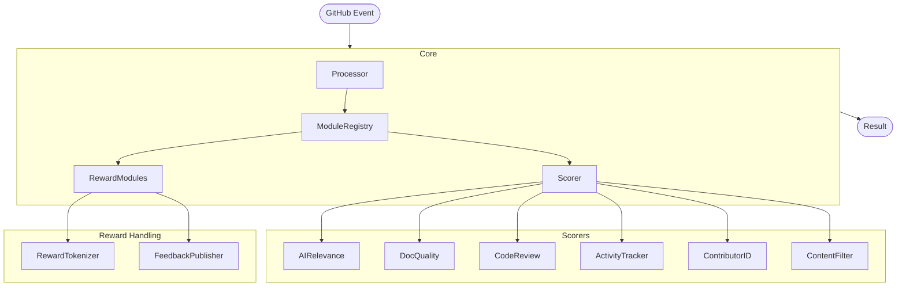

# Text Conversation Rewards Refactoring Battle Plan

This document outlines a comprehensive plan for refactoring the `text-conversation-rewards` system to improve its architecture, maintainability, and extendability.

## Current System Analysis

The current system uses a processor-based architecture with multiple "module" classes that each handle specific aspects of reward calculation:



### Current Scoring Strategies

After analyzing the codebase, we've identified the following scoring strategies:

#### 1. ContentEvaluatorModule
- **Purpose**: Evaluates the relevance of comments using OpenAI's API
- **Key Features**:
  - Uses LLM to evaluate comment relevance on a 0-1 scale
  - Handles both issue comments and PR comments differently
  - Applies fixed relevance multipliers for certain comment types
  - Uses token chunking for large content to stay within token limits
  - Handles retry logic for API failures

#### 2. FormattingEvaluatorModule
- **Purpose**: Scores comment formatting and readability
- **Key Features**:
  - Evaluates HTML elements and structure (headings, lists, code blocks, etc.)
  - Calculates Flesch-Kincaid readability scores
  - Measures word count with configurable exponent
  - Applies multipliers based on formatting elements
  - Processes markdown into HTML for scoring

#### 3. ReviewIncentivizerModule
- **Purpose**: Rewards users for reviewing pull requests
- **Key Features**:
  - Calculates rewards based on diff sizes (additions/deletions)
  - Applies priority multipliers based on issue labels
  - Handles file exclusion patterns for fair scoring
  - Compares commit changes to evaluate review effort

#### 4. EventIncentivesModule
- **Purpose**: Tracks and rewards GitHub interaction events
- **Key Features**:
  - Processes various GitHub events (comments, reactions, reviews)
  - Tracks both sent and received reactions
  - Counts occurrences of different event types
  - Associates events with users for reward calculation

#### 5. UserExtractorModule
- **Purpose**: Extracts users from GitHub activity for reward distribution
- **Key Features**:
  - Identifies all users involved in an issue
  - Associates comments with their authors
  - Prepares the initial result structure for other modules

#### 6. DataPurgeModule
- **Purpose**: Filters out certain types of content
- **Key Features**:
  - Removes hidden comments
  - Filters based on user blocklists
  - Excludes comments based on content rules
  - Handles moderation tasks

#### 7. PermitGenerationModule
- **Purpose**: Generates reward tokens or permits
- **Key Features**:
  - Creates digitally signed permits for rewards
  - Handles reward issuance logic
  - Interfaces with payment/token systems

#### 8. GithubCommentModule
- **Purpose**: Posts summary comments to GitHub
- **Key Features**:
  - Generates formatted reward summaries
  - Posts comments to issues
  - Creates visual feedback for users

## Issues with Current Architecture

1. **Monolithic Modules**: Each module contains multiple responsibilities
2. **Tight Coupling**: Modules often know too much about each other
3. **Configuration Complexity**: Configuration is spread across many files
4. **Testing Difficulty**: Hard to test modules in isolation
5. **Naming Inconsistency**: Module names don't clearly indicate their purpose
6. **Code Organization**: Related functionality is spread across different files
7. **Extensibility Challenges**: Adding new scoring strategies requires modifying existing code

## Proposed Strategy Name Improvements

Current names can be improved for clarity:

| Current Name | Proposed Name | Reasoning |
|--------------|---------------|-----------|
| ContentEvaluatorModule | AIRelevanceScorer | Clearly indicates it uses AI to score relevance |
| FormattingEvaluatorModule | DocumentQualityScorer | Better reflects its focus on text quality and readability |
| ReviewIncentivizerModule | CodeReviewRewarder | Directly states its purpose of rewarding code reviews |
| EventIncentivesModule | GithubActivityTracker | Clarifies that it tracks various GitHub activities |
| UserExtractorModule | ContributorIdentifier | More clearly describes extracting contributors |
| DataPurgeModule | ContentFilterer | Clearer about filtering out unwanted content |
| PermitGenerationModule | RewardTokenizer | Better describes generating reward tokens |
| GithubCommentModule | FeedbackPublisher | Indicates it publishes feedback to repos |

## Proposed File Structure

The new file structure will organize code by responsibility, following modern TypeScript best practices:

```
src/
├── config/                         # Configuration schemas and defaults
│   ├── index.ts                    # Exports all configuration
│   ├── types.ts                    # Shared configuration types
│   ├── ai-relevance-config.ts      # AI relevance scoring config
│   ├── document-quality-config.ts  # Document quality scoring config
│   ├── code-review-config.ts       # Code review scoring config
│   ├── activity-tracking-config.ts # Activity tracking config
│   └── environment.ts              # Environment variable schema
│
├── core/                           # Core framework code
│   ├── processor.ts                # Main scoring processor
│   ├── module-base.ts              # Base module interface/class
│   ├── issue-activity.ts           # Issue activity data collection
│   └── types.ts                    # Core type definitions
│
├── scorers/                        # All scoring strategies
│   ├── ai-relevance/               # AI-based relevance scoring
│   │   ├── index.ts                # Main scorer module
│   │   ├── prompt-manager.ts       # Manages AI prompts
│   │   └── types.ts                # Types specific to this scorer
│   ├── document-quality/           # Document quality scoring
│   │   ├── index.ts
│   │   ├── readability.ts          # Readability calculation
│   │   ├── formatting.ts           # Format scoring logic
│   │   └── types.ts
│   ├── code-review/                # Code review scoring
│   │   ├── index.ts
│   │   ├── diff-analyzer.ts        # Analyzes code diffs
│   │   └── types.ts
│   ├── activity-tracking/          # GitHub activity tracking
│   │   ├── index.ts
│   │   ├── event-processor.ts      # Processes GitHub events
│   │   ├── reaction-processor.ts   # Processes reactions
│   │   └── types.ts
│   ├── contributor-identifier/
│   │   └── index.ts
│   ├── content-filter/
│   │   └── index.ts
│   └── index.ts                    # Exports all scorers
│
├── rewards/                        # Reward generation and publishing
│   ├── reward-tokenizer/
│   │   └── index.ts                # Generates reward tokens
│   ├── feedback-publisher/
│   │   └── index.ts                # Posts feedback comments
│   └── index.ts                    # Exports all reward modules
│
├── utils/                          # Shared utilities
│   ├── github.ts                   # GitHub API helpers
│   ├── retry.ts                    # Retry mechanism
│   ├── url.ts                      # URL processing utilities
│   ├── markdown.ts                 # Markdown utilities
│   └── permissions.ts              # Permission checking
│
├── types/                          # Shared type definitions
│   ├── github-types.ts             # GitHub API type definitions
│   ├── module-types.ts             # Module interface definitions
│   ├── results.ts                  # Result type definitions
│   └── index.ts                    # Exports all types
│
└── index.ts                        # Main entry point
```

## New Architecture Flow



## Implementation Plan

### Phase 1: Core Infrastructure (Week 1)

1. **Setup Project Structure**
   - Create folder hierarchy
   - Move shared utilities to new locations
   - Establish module interfaces

2. **Implement Core Types**
   - Define shared type interfaces
   - Create base module classes
   - Set up configuration schema structure

3. **Migration Planning**
   - Identify dependencies between modules
   - Plan migration sequence
   - Create module stubs

### Phase 2: Scorer Migration (Weeks 2-3)

1. **ContributorIdentifier** (former UserExtractorModule)
   - Move core functionality with minimal changes
   - Update interfaces and types
   - Add unit tests

2. **ContentFilterer** (former DataPurgeModule)
   - Isolate filtering logic
   - Create clean interface
   - Add unit tests

3. **DocumentQualityScorer** (former FormattingEvaluatorModule)
   - Split into readability and formatting sub-modules
   - Clean up HTML/markdown processing
   - Add unit tests

4. **AIRelevanceScorer** (former ContentEvaluatorModule)
   - Isolate AI prompt management
   - Improve error handling
   - Add unit tests

5. **CodeReviewRewarder** (former ReviewIncentivizerModule)
   - Clean up diff analysis
   - Extract file exclusion logic
   - Add unit tests

6. **GithubActivityTracker** (former EventIncentivesModule)
   - Separate event and reaction processing
   - Create event categorization
   - Add unit tests

### Phase 3: Reward Modules Migration (Week 4)

1. **RewardTokenizer** (former PermitGenerationModule)
   - Isolate token generation logic
   - Improve interfaces
   - Add unit tests

2. **FeedbackPublisher** (former GithubCommentModule)
   - Extract template management
   - Improve formatting
   - Add unit tests

### Phase 4: Core Processor Refactoring (Week 5)

1. **ModuleRegistry**
   - Create pluggable module system
   - Implement module dependency resolution
   - Add dynamic enabling/disabling

2. **New Processor**
   - Implement pipeline processing
   - Add hooks for module interaction
   - Create cleaner result management

3. **Integration Tests**
   - Test full pipeline
   - Verify backward compatibility
   - Create regression tests

### Phase 5: Configuration and Docs (Week 6)

1. **Configuration System**
   - Implement configuration validation
   - Create sensible defaults
   - Add schema documentation

2. **Documentation**
   - Create module documentation
   - Document extension points
   - Add examples

3. **Final Integration**
   - End-to-end testing
   - Performance testing
   - Deployment planning

## Architectural Improvements

### 1. Dependency Injection

The new architecture will use dependency injection to:
- Make testing easier by allowing mock dependencies
- Remove direct instantiation within modules
- Allow runtime configuration of dependencies

Example interface:
```typescript
interface ModuleContext {
  logger: Logger;
  config: ConfigService;
  octokit: Octokit;
  // Other shared services
}

abstract class BaseModule<TConfig, TResult> {
  constructor(protected context: ModuleContext) {}
  abstract transform(data: IssueActivity, result: TResult): Promise<TResult>;
}
```

### 2. Enhanced Configuration

Configuration will be improved with:
- Runtime validation for all config
- Better error messages
- Default configurations
- Schema documentation
- Typed configuration

Example:
```typescript
export const aiRelevanceConfigSchema = Type.Object({
  enabled: Type.Boolean(),
  openAi: Type.Object({
    model: Type.String(),
    tokenCountLimit: Type.Number(),
    maxRetries: Type.Number(),
    endpoint: Type.Optional(Type.String()),
  }),
  multipliers: Type.Optional(Type.Array(
    Type.Object({
      role: Type.Array(Type.String()),
      relevance: Type.Number(),
    })
  )),
});

export type AIRelevanceConfig = Static<typeof aiRelevanceConfigSchema>;
```

### 3. Modular Architecture

The new architecture will:
- Allow enabling/disabling modules at runtime
- Make it easier to add new scoring strategies
- Provide extension points for custom scoring
- Support different module combinations

Example:
```typescript
class ModuleRegistry {
  private modules: Map<string, BaseModule<any, any>> = new Map();

  register(name: string, module: BaseModule<any, any>): void {
    this.modules.set(name, module);
  }

  getEnabledModules(): BaseModule<any, any>[] {
    return Array.from(this.modules.values())
      .filter(module => module.enabled);
  }
}
```

### 4. Error Handling

Improvements to error handling:
- Standardized error types
- Consistent error logging
- Better recovery mechanisms
- Detailed error reporting

Example:
```typescript
export class ModuleError extends Error {
  constructor(
    message: string,
    readonly moduleName: string,
    readonly code: ErrorCode,
    readonly context?: Record<string, unknown>
  ) {
    super(`[${moduleName}] ${message}`);
  }
}
```

## Testing Strategy

The new architecture will improve testability with:

1. **Unit Tests**
   - Test each module in isolation
   - Use dependency injection for mocking
   - Test edge cases thoroughly

2. **Integration Tests**
   - Test module combinations
   - Verify correct data flow
   - Test configuration variations

3. **Snapshot Tests**
   - Verify output consistency
   - Catch unintended changes

4. **Performance Tests**
   - Test with large datasets
   - Measure processing time
   - Identify bottlenecks

## Conclusion

This refactoring plan provides a clear path to transform the current monolithic module architecture into a more maintainable, testable, and extensible system. By reorganizing code around responsibilities, improving naming, and implementing modern architectural patterns, we will create a system that is easier to understand, extend, and maintain.

The implementation will be phased to ensure each component is properly migrated and tested before moving to the next, minimizing the risk of introducing bugs or regressions. The end result will be a more robust system that can easily accommodate new scoring strategies and rewards mechanisms.
