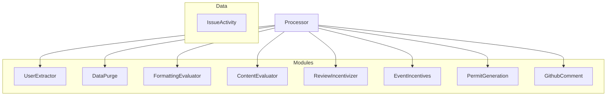
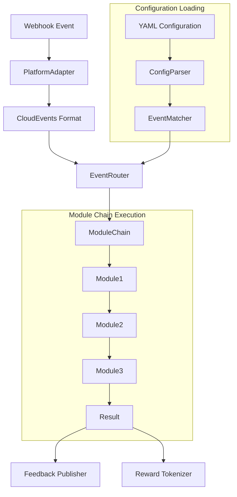

# Text Conversation Rewards Refactoring Battle Plan

This document outlines a comprehensive plan for refactoring the `text-conversation-rewards` system to improve its architecture, maintainability, and extendability.

## Current System Analysis

The current system uses a processor-based architecture with multiple "module" classes that each handle specific aspects of reward calculation:



### Current Scoring Strategies

After analyzing the codebase, we've identified the following scoring strategies:

#### 1. ContentEvaluatorModule
- **Purpose**: Evaluates the relevance of comments using OpenAI's API
- **Key Features**:
  - Uses LLM to evaluate comment relevance on a 0-1 scale
  - Handles both issue comments and PR comments differently
  - Applies fixed relevance multipliers for certain comment types
  - Uses token chunking for large content to stay within token limits
  - Handles retry logic for API failures

#### 2. FormattingEvaluatorModule
- **Purpose**: Scores comment formatting and readability
- **Key Features**:
  - Evaluates HTML elements and structure (headings, lists, code blocks, etc.)
  - Calculates Flesch-Kincaid readability scores
  - Measures word count with configurable exponent
  - Applies multipliers based on formatting elements
  - Processes markdown into HTML for scoring

#### 3. ReviewIncentivizerModule
- **Purpose**: Rewards users for reviewing pull requests
- **Key Features**:
  - Calculates rewards based on diff sizes (additions/deletions)
  - Applies priority multipliers based on issue labels
  - Handles file exclusion patterns for fair scoring
  - Compares commit changes to evaluate review effort

#### 4. EventIncentivesModule
- **Purpose**: Tracks and rewards GitHub interaction events
- **Key Features**:
  - Processes various GitHub events (comments, reactions, reviews)
  - Tracks both sent and received reactions
  - Counts occurrences of different event types
  - Associates events with users for reward calculation

#### 5. UserExtractorModule
- **Purpose**: Extracts users from GitHub activity for reward distribution
- **Key Features**:
  - Identifies all users involved in an issue
  - Associates comments with their authors
  - Prepares the initial result structure for other modules

#### 6. DataPurgeModule
- **Purpose**: Filters out certain types of content
- **Key Features**:
  - Removes hidden comments
  - Filters based on user blocklists
  - Excludes comments based on content rules
  - Handles moderation tasks

#### 7. PermitGenerationModule
- **Purpose**: Generates reward tokens or permits
- **Key Features**:
  - Creates digitally signed permits for rewards
  - Handles reward issuance logic
  - Interfaces with payment/token systems

#### 8. GithubCommentModule
- **Purpose**: Posts summary comments to GitHub
- **Key Features**:
  - Generates formatted reward summaries
  - Posts comments to issues
  - Creates visual feedback for users

## Issues with Current Architecture

1. **Monolithic Modules**: Each module contains multiple responsibilities
2. **Tight Coupling**: Modules often know too much about each other
3. **Configuration Complexity**: Configuration is spread across many files
4. **Testing Difficulty**: Hard to test modules in isolation
5. **Naming Inconsistency**: Module names don't clearly indicate their purpose
6. **Code Organization**: Related functionality is spread across different files
7. **Extensibility Challenges**: Adding new scoring strategies requires modifying existing code

## Proposed Strategy Name Improvements

Current names can be improved for clarity:

| Current Name | Proposed Name | Reasoning |
|--------------|---------------|-----------|
| ContentEvaluatorModule | AIRelevanceScorer | Clearly indicates it uses AI to score relevance |
| FormattingEvaluatorModule | DocumentQualityScorer | Better reflects its focus on text quality and readability |
| ReviewIncentivizerModule | CodeReviewRewarder | Directly states its purpose of rewarding code reviews |
| EventIncentivesModule | GithubActivityTracker | Clarifies that it tracks various GitHub activities |
| UserExtractorModule | ContributorIdentifier | More clearly describes extracting contributors |
| DataPurgeModule | ContentFilterer | Clearer about filtering out unwanted content |
| PermitGenerationModule | RewardTokenizer | Better describes generating reward tokens |
| GithubCommentModule | FeedbackPublisher | Indicates it publishes feedback to repos |

## Enhanced Vision: Platform-Agnostic, Event-Driven Architecture

Our enhanced architecture vision expands beyond just GitHub to support multiple platforms (Google Docs, Telegram, etc.) using a standardized event format and a flexible, declarative configuration system.

### Key Architectural Principles

1. **Platform Agnosticism**: All modules should work with any source of data
2. **Standardized Event Format**: Using CloudEvents for cross-platform consistency
3. **Declarative Configuration**: GitHub Actions-style YAML for defining module chains
4. **Event-Driven Processing**: Any webhook event can trigger specific module chains

### CloudEvents Standard

We'll use the [CloudEvents](https://cloudevents.io/) specification (a CNCF standard) as our normalized event format:

```json
{
  "specversion": "1.0",
  "type": "com.github.issue.comment.created",
  "source": "https://github.com/orgname/repo",
  "id": "A234-1234-1234",
  "time": "2025-03-22T14:30:00Z",
  "datacontenttype": "application/json",
  "data": {
    "issue": {
      "id": 123,
      "title": "Issue title"
    },
    "comment": {
      "id": 456,
      "author": "username",
      "content": "Comment text",
      "contentFormat": "markdown"
    }
  }
}
```

### GitHub Actions-Style Configuration

Configurations will use a familiar, declarative YAML format:

```yaml
name: "Comment Quality Rewards"
description: "Rewards quality comments on issues with tokens"

# Events that trigger this workflow
on:
  github:
    issue_comment:
      - created
      - edited

  google_docs:
    document:
      - edited

# Global configuration
config:
  reward_threshold: 0.7
  openai_model: "gpt-4o"

# Module chain definitions
modules:
  # Define the sequence of modules to run
  - uses: contributor-identifier
    id: users

  - uses: content-filter
    id: filter
    with:
      exclude_bots: true
      min_length: 10

  - uses: document-quality-scorer
    id: quality
    with:
      calculate_readability: true
      word_count_exponent: 0.85

  - uses: ai-relevance-scorer
    id: relevance
    with:
      model: ${{ config.openai_model }}

  - uses: reward-tokenizer
    id: rewards
    with:
      threshold: ${{ config.reward_threshold }}
      min_quality_score: 0.5
      use_relevance_from: ${{ steps.relevance.outputs.scores }}
      use_quality_from: ${{ steps.quality.outputs.scores }}

  - uses: feedback-publisher
    if: ${{ github.event_name == 'issue_comment.created' }}
    with:
      comment_template: "reward-summary.md"
      include_scores: true
```

## Proposed File Structure

The new file structure will organize code by responsibility, following modern TypeScript best practices:

```
src/
├── config/                         # Configuration schemas and defaults
│   ├── index.ts                    # Exports all configuration
│   ├── types.ts                    # Shared configuration types
│   ├── ai-relevance-config.ts      # AI relevance scoring config
│   ├── document-quality-config.ts  # Document quality scoring config
│   ├── code-review-config.ts       # Code review scoring config
│   └── environment.ts              # Environment variable schema
│
├── core/                           # Core framework code
│   ├── processor.ts                # Main scoring processor
│   ├── module-base.ts              # Base module interface/class
│   ├── event-router.ts             # Routes events to module chains
│   ├── module-chain-registry.ts    # Manages module chains
│   └── types.ts                    # Core type definitions
│
├── platforms/                      # Platform-specific adapters
│   ├── base-platform.ts            # Base platform interface
│   ├── github/                     # GitHub adapter
│   │   ├── adapter.ts              # Converts GitHub webhooks to CloudEvents
│   │   └── event-mapper.ts         # Maps GitHub events to standard format
│   ├── google-docs/                # Google Docs adapter
│   │   ├── adapter.ts              # Converts Google Docs events to CloudEvents
│   │   └── event-mapper.ts         # Maps Google Docs events to standard format
│   └── telegram/                   # Telegram adapter
│       ├── adapter.ts              # Converts Telegram events to CloudEvents
│       └── event-mapper.ts         # Maps Telegram events to standard format
│
├── scorers/                        # All scoring strategies
│   ├── ai-relevance/               # AI-based relevance scoring
│   │   ├── index.ts                # Main scorer module
│   │   ├── prompt-manager.ts       # Manages AI prompts
│   │   └── types.ts                # Types specific to this scorer
│   ├── document-quality/           # Document quality scoring
│   │   ├── index.ts
│   │   ├── readability.ts          # Readability calculation
│   │   ├── formatting.ts           # Format scoring logic
│   │   └── types.ts
│   ├── code-review/                # Code review scoring
│   │   ├── index.ts
│   │   ├── diff-analyzer.ts        # Analyzes code diffs
│   │   └── types.ts
│   ├── activity-tracking/          # Activity tracking across platforms
│   │   ├── index.ts
│   │   ├── event-processor.ts      # Processes normalized events
│   │   ├── reaction-processor.ts   # Processes reactions
│   │   └── types.ts
│   ├── contributor-identifier/
│   │   └── index.ts
│   ├── content-filter/
│   │   └── index.ts
│   └── index.ts                    # Exports all scorers
│
├── rewards/                        # Reward generation and publishing
│   ├── reward-tokenizer/
│   │   └── index.ts                # Generates reward tokens
│   ├── feedback-publisher/
│   │   └── index.ts                # Posts feedback to various platforms
│   └── index.ts                    # Exports all reward modules
│
├── config-parser/                  # YAML configuration parsing
│   ├── parser.ts                   # Parses YAML configurations
│   ├── schema.ts                   # JSON Schema for validation
│   └── expression-evaluator.ts     # Evaluates ${{ expressions }}
│
├── utils/                          # Shared utilities
│   ├── cloud-events.ts             # CloudEvents utilities
│   ├── retry.ts                    # Retry mechanism
│   ├── markdown.ts                 # Markdown utilities
│   └── permissions.ts              # Permission checking
│
├── types/                          # Shared type definitions
│   ├── cloud-event.ts              # CloudEvents type definitions
│   ├── module-types.ts             # Module interface definitions
│   ├── results.ts                  # Result type definitions
│   └── index.ts                    # Exports all types
│
└── index.ts                        # Main entry point
```

## New Architecture Flow



## Implementation Plan

### Phase 1: Core Infrastructure (Week 1)

1. **Setup Project Structure**
   - Create folder hierarchy
   - Implement CloudEvents type definitions
   - Establish base module interfaces

2. **Platform Adapter Framework**
   - Create base platform adapter interface
   - Implement GitHub adapter (initial focus)
   - Set up event normalization system

3. **Configuration Parser**
   - Implement YAML configuration parser
   - Create JSON schema validation
   - Build expression evaluation engine

### Phase 2: Module Framework & First Modules (Weeks 2-3)

1. **Event Router & Module Chain Registry**
   - Implement event routing system
   - Create module chain registry
   - Build execution pipeline

2. **Adapt Core Modules to CloudEvents**
   - Refactor modules to process CloudEvents
   - Make modules platform-agnostic
   - Add unit tests for each module

3. **Implement Platform-Independent Modules**
   - Migrate DocumentQualityScorer and AIRelevanceScorer first
   - Make them work with normalized content from any source
   - Ensure they correctly handle various content formats

4. **GitHub-Specific Module Adaption**
   - Adapt ReviewIncentivizerModule to CodeReviewRewarder
   - Convert UserExtractorModule to ContributorIdentifier
   - Adapt other GitHub-specific modules

### Phase 3: Multi-Platform Support (Week 4)

1. **Additional Platform Adapters**
   - Implement Google Docs adapter
   - Implement Telegram adapter (if needed)
   - Create platform-specific normalizers

2. **Platform-Agnostic Reward System**
   - Refactor RewardTokenizer to work with any platform
   - Make FeedbackPublisher support multiple platforms
   - Create platform-specific feedback formatters

### Phase 4: Configuration & Chain System (Week 5)

1. **YAML Configuration System**
   - Implement full GitHub Actions-style configuration parsing
   - Create configuration templating system
   - Add support for variables and expressions

2. **Module Chain Building**
   - Build dynamic module chain assembly
   - Implement conditional execution based on event types
   - Add support for sharing data between modules

3. **Integration Tests**
   - Test cross-platform event handling
   - Verify configuration system with real-world examples
   - Test backward compatibility with existing configurations

### Phase 5: Polish & Documentation (Week 6)

1. **Configuration Templates & Examples**
   - Create templates for common use cases
   - Provide example configurations for each platform
   - Add comprehensive configuration documentation

2. **Module Documentation**
   - Document each module's capabilities
   - Provide examples of chain configurations
   - Create developer guide for extending the system

3. **Final Integration & Testing**
   - End-to-end testing across platforms
   - Performance optimization
   - Deployment and migration planning

## Architectural Improvements

### 1. Platform-Agnostic Module Interface

The new architecture uses CloudEvents and a platform-agnostic interface:

```typescript
interface Module {
  // Each module declares what event types it can handle
  supportedEventTypes: string[] | RegExp;

  // Process a CloudEvents document
  transform(event: CloudEvent, result: any): Promise<any>;
}

// Base implementation all modules can extend
abstract class BaseModule implements Module {
  constructor(protected context: ModuleContext) {}

  // Default implementation that can be overridden
  canProcess(event: CloudEvent): boolean {
    if (Array.isArray(this.supportedEventTypes)) {
      return this.supportedEventTypes.includes(event.type);
    }
    return this.supportedEventTypes.test(event.type);
  }

  // Must be implemented by each module
  abstract transform(event: CloudEvent, result: any): Promise<any>;
}
```

### 2. GitHub Actions-Style Configuration

The system uses a familiar, declarative YAML configuration:

```typescript
// Configuration schema with JSON Schema validation
export const workflowConfigSchema = {
  type: 'object',
  required: ['name', 'on', 'modules'],
  properties: {
    name: { type: 'string' },
    description: { type: 'string' },
    on: {
      type: 'object',
      additionalProperties: {
        type: 'object',
        additionalProperties: {
          type: 'array',
          items: { type: 'string' }
        }
      }
    },
    config: { type: 'object' },
    modules: {
      type: 'array',
      items: {
        type: 'object',
        required: ['uses'],
        properties: {
          uses: { type: 'string' },
          id: { type: 'string' },
          if: { type: 'string' },
          with: { type: 'object' }
        }
      }
    }
  }
};
```

### 3. Event-Driven Architecture with CloudEvents

The system processes standardized CloudEvents:

```typescript
interface CloudEvent {
  // Required CloudEvents attributes
  specversion: string;  // CloudEvents spec version
  id: string;           // Unique event identifier
  source: string;       // URI identifying the event producer
  type: string;         // Event type (e.g., "com.github.issue.comment.created")

  // Optional CloudEvents attributes
  datacontenttype?: string;  // Content type of data (e.g., "application/json")
  dataschema?: string;       // URI to the schema of the data
  subject?: string;          // Subject of the event
  time?: string;             // Timestamp of when the event occurred

  // The actual event data
  data: any;
}

class EventRouter {
  constructor(private moduleChainRegistry: ModuleChainRegistry) {}

  async routeEvent(event: CloudEvent): Promise<any> {
    // Find matching chains for this event type
    const chains = this.moduleChainRegistry.getMatchingChains(event.type);

    // Execute each matching chain in parallel
    const results = await Promise.all(
      chains.map(chain => this.executeChain(chain, event))
    );

    return results;
  }

  private async executeChain(chain: ModuleChain, event: CloudEvent): Promise<any> {
    let result = {};

    for (const module of chain.modules) {
      // Skip modules that don't apply to this event
      if (!module.canProcess(event)) continue;

      // Apply module transformation
      result = await module.transform(event, result);
    }

    return result;
  }
}
```

### 4. Declarative Module Chains

The system uses a declarative approach to configure module chains:

```typescript
class ModuleChainBuilder {
  private registry: Map<string, ModuleFactory> = new Map();

  // Register module factories
  register(name: string, factory: ModuleFactory): void {
    this.registry.set(name, factory);
  }

  // Build a chain from YAML configuration
  buildChain(config: WorkflowConfig): ModuleChain {
    const modules: Module[] = [];

    for (const moduleConfig of config.modules) {
      // Get the module factory
      const factory = this.registry.get(moduleConfig.uses);
      if (!factory) throw new Error(`Unknown module: ${moduleConfig.uses}`);

      // Create module instance with configuration
      const module = factory.create(moduleConfig.with || {});

      // Add conditional execution if specified
      if (moduleConfig.if) {
        const originalCanProcess = module.canProcess.bind(module);
        module.canProcess = (event: CloudEvent) => {
          // Evaluate the condition expression
          return evaluateCondition(moduleConfig.if, event) && originalCanProcess(event);
        };
      }

      modules.push(module);
    }

    return new ModuleChain(modules);
  }
}
```

## Testing Strategy

The new architecture will improve testability with:

1. **Unit Tests**
   - Test each module in isolation
   - Use dependency injection for mocking
   - Test edge cases thoroughly

2. **Integration Tests**
   - Test module combinations
   - Verify correct data flow
   - Test configuration variations

3. **Snapshot Tests**
   - Verify output consistency
   - Catch unintended changes

4. **Performance Tests**
   - Test with large datasets
   - Measure processing time
   - Identify bottlenecks

## Additional Platform-Specific Considerations

### GitHub

- Implement webhook signature validation
- Handle GitHub-specific rate limiting
- Map GitHub's event types to CloudEvents format

### Google Docs

- Implement Google OAuth for authentication
- Handle Google Docs revision history mapping
- Extract text content from various Google document formats

### Telegram

- Process Telegram Bot API webhooks
- Handle message formats and attachments
- Map chat structures to standard event format

## Conclusion

This enhanced refactoring plan transforms the current GitHub-focused architecture into a versatile, platform-agnostic system for processing and rewarding content across multiple platforms. By adopting CloudEvents as our standardized format and GitHub Actions-style YAML for configuration, we create a system that is:

1. **Easily Extensible** - Add new platforms by just creating adapters
2. **Highly Configurable** - Create custom workflows for different event types
3. **Developer Friendly** - Use familiar GitHub Actions-style configuration
4. **Standards Compliant** - Built on established industry standards

The implementation will be phased to ensure each component is properly migrated and tested, with an initial focus on GitHub compatibility while building the foundation for multi-platform support. The end result will be a powerful system that can process and reward content from any webhook-capable platform using consistent scoring strategies.
