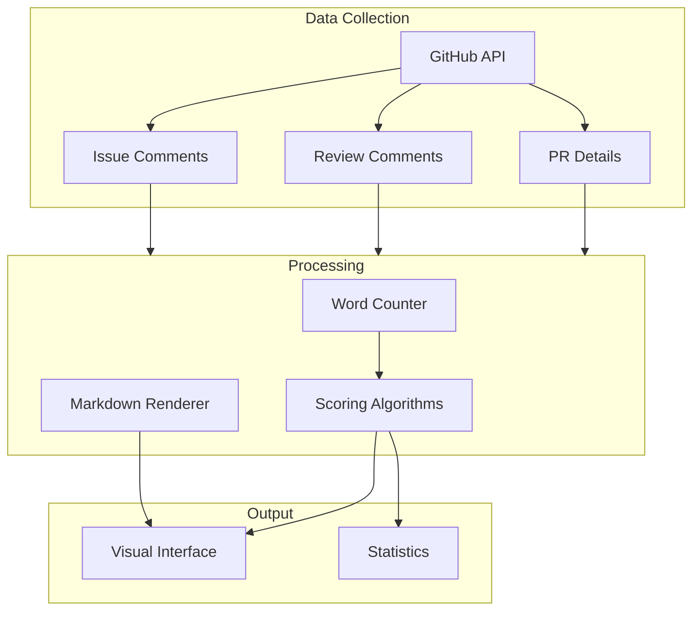
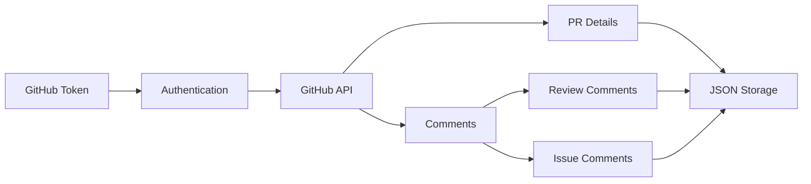
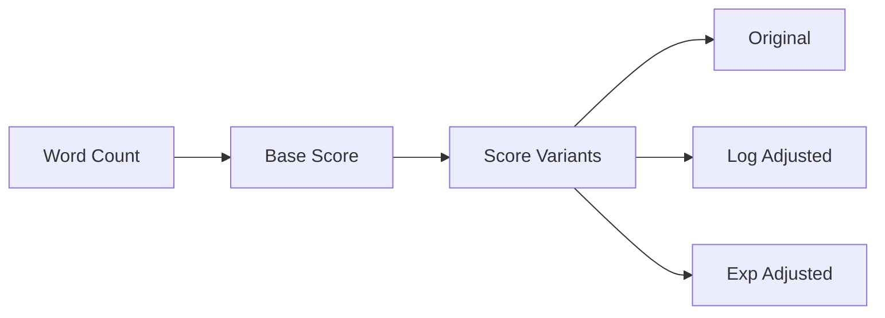
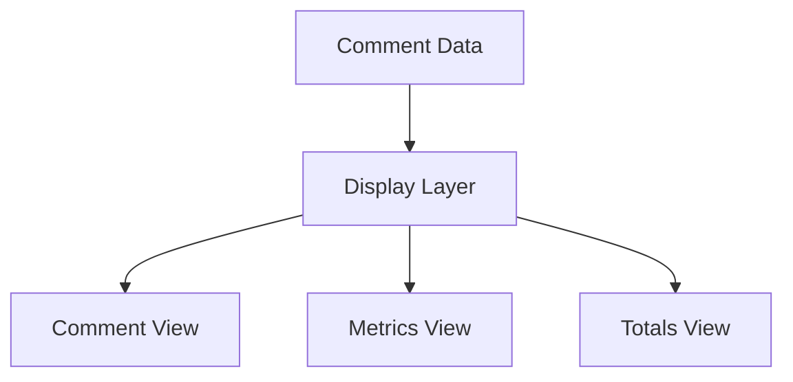

# System Patterns

## Architecture Overview



## Core Components

### 1. Data Collection


### 2. Scoring System


### 3. Visualization


## Design Patterns

### 1. Data Processing
- **Pattern**: Pipeline Processing
- **Implementation**: Sequential text transformations
- **Benefits**: Clear data flow, easy to modify/extend
```javascript
cleanText
  .replace(/`[^`]*`/g, '')        // Remove code blocks
  .replace(/\[([^\]]+)\]\([^)]+\)/g, '$1')  // Process links
  .replace(/^-{3,}$/gm, '')       // Remove horizontal rules
  .replace(/^>\s*/gm, '')         // Process blockquotes
```

### 2. Score Calculation
- **Pattern**: Strategy Pattern
- **Implementation**: Pluggable scoring algorithms
- **Benefits**: Easy to add new scoring methods
```javascript
const scoringStrategies = {
    original: (wordCount) => Math.pow(wordCount, 0.85),
    logAdjusted: (wordCount) => Math.pow(wordCount, 0.85) * (1/Math.log2(wordCount + 2)),
    expAdjusted: (wordCount) => Math.pow(wordCount, 0.85) * Math.exp(-wordCount/100)
};
```

### 3. Visualization
- **Pattern**: Component-Based
- **Implementation**: Modular HTML/CSS structure
- **Benefits**: Maintainable, reusable components

## Technical Decisions

### 1. No Build Tools
- **Decision**: Pure HTML/JS/CSS
- **Rationale**: Maximum portability, simplicity
- **Impact**: Self-contained, easy to deploy

### 2. Minimal Dependencies
- **Decision**: Only marked.js
- **Rationale**: Reduce complexity, ensure longevity
- **Impact**: Lightweight, maintainable

### 3. Client-Side Processing
- **Decision**: All processing in browser
- **Rationale**: Simple deployment, immediate feedback
- **Impact**: Easy to use, no server needed

## Implementation Guidelines

### 1. Data Processing
- Keep text processing steps separate
- Maintain clear transformation chain
- Document regex patterns

### 2. Scoring
- Use clear variable names
- Document mathematical formulas
- Keep algorithms pure functions

### 3. Visualization
- Follow GitHub styling patterns
- Maintain responsive design
- Use semantic HTML

## Error Handling

### 1. Data Validation
- Check for valid JSON
- Validate comment structure
- Handle missing fields

### 2. Processing
- Handle empty comments
- Manage edge cases in word counting
- Validate scoring inputs

### 3. Display
- Graceful fallback for rendering
- Clear error messages
- Default values for missing data

## Performance Considerations

### 1. Processing
- Efficient regex patterns
- Minimal DOM operations
- Optimized loops

### 2. Rendering
- Lazy loading for long discussions
- Efficient markdown parsing
- Minimal reflows

### 3. Memory
- Clear data structures
- Avoid memory leaks
- Garbage collection friendly
