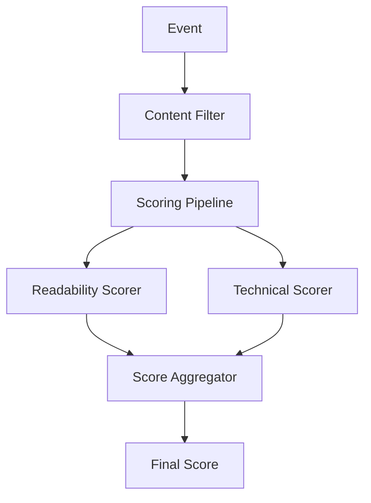

# Source Code Architecture

This document outlines the architecture and organization of the source code.

## Core Components

### Scoring System
- `scorers/` - Contains all scoring-related functionality
  - `base-scorer.ts` - Base class for implementing scoring strategies
  - `readability-scorer.ts` - Scores content based on readability metrics
  - `technical-scorer.ts` - Scores content based on technical writing quality
  - `score-aggregator.ts` - Aggregates scores from multiple scorers
  - `index.ts` - Exports all scoring components

### Module System
- `modules/` - Contains processing modules that can be chained together
  - `content-filter.ts` - Filters and validates content
  - `scoring-pipeline.ts` - Orchestrates the scoring process
  - `index.ts` - Exports active modules and documentation

### Core Infrastructure
- `core/` - Core system components
  - `module-base.ts` - Base class for all modules
  - `module-chain.ts` - Module chaining and execution system
  - `event-router.ts` - Routes events to appropriate module chains
  - `browser-events.ts` - Browser-side event handling
  - `cloud-events.ts` - CloudEvents implementation

### Web Components
- `components/` - Reusable UI components
  - `comment-component.ts` - Comment display and interaction
  - `score-summary-component.ts` - Score visualization

### Server & API
- `server.ts` - Main server implementation
- `index.ts` - API endpoints and webhook processing

### UI Management
- `main.ts` - Main application entry point
- `dom-manager.ts` - Centralized DOM manipulation
- `event-manager.ts` - UI event handling
- `ui-state-manager.ts` - UI state management

### GitHub Integration
- `github/` - GitHub-specific functionality
  - `github-client.ts` - GitHub API client
  - `github-utils.ts` - GitHub-related utilities
  - `queries.ts` - GraphQL queries
  - `types.ts` - GitHub-specific types

### Experimental Features
- `experimental/` - Contains experimental modules and features
  - See [experimental/README.md](experimental/README.md) for details

## Module Chain Architecture

The application uses a modular chain-based architecture where functionality is composed through chainable modules:

## Adding New Features

### New Scorer
1. Create a new class extending `BaseScorer` in `scorers/`
2. Implement the required scoring logic
3. Add unit tests in `__tests__/scorers/`
4. Export the scorer in `scorers/index.ts`

### New Module
1. Create a new class extending `BaseModule` in `modules/`
2. Implement the required processing logic
3. Add unit tests in `__tests__/modules/`
4. Export the module in `modules/index.ts`

## Testing

- Tests are organized to mirror the source structure
- Each major component has its own test suite
- Mock implementations are provided where needed
- Use `bun test` to run the test suite
